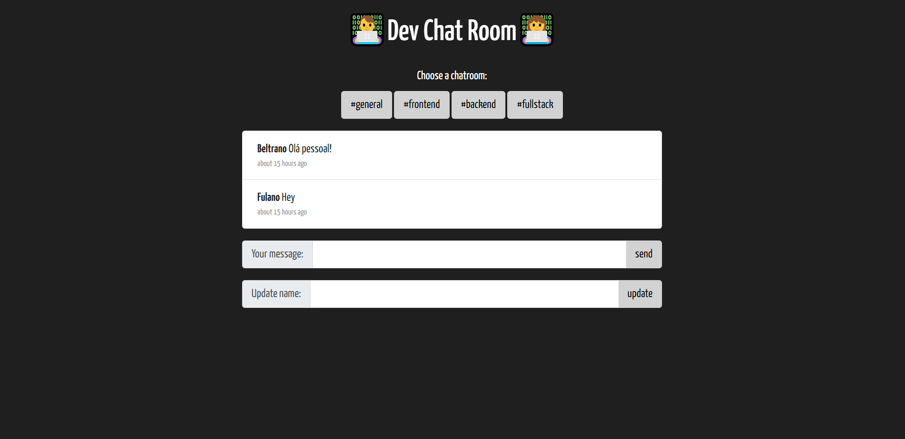
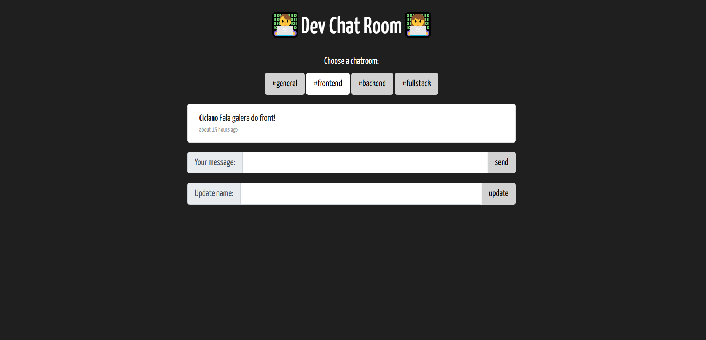
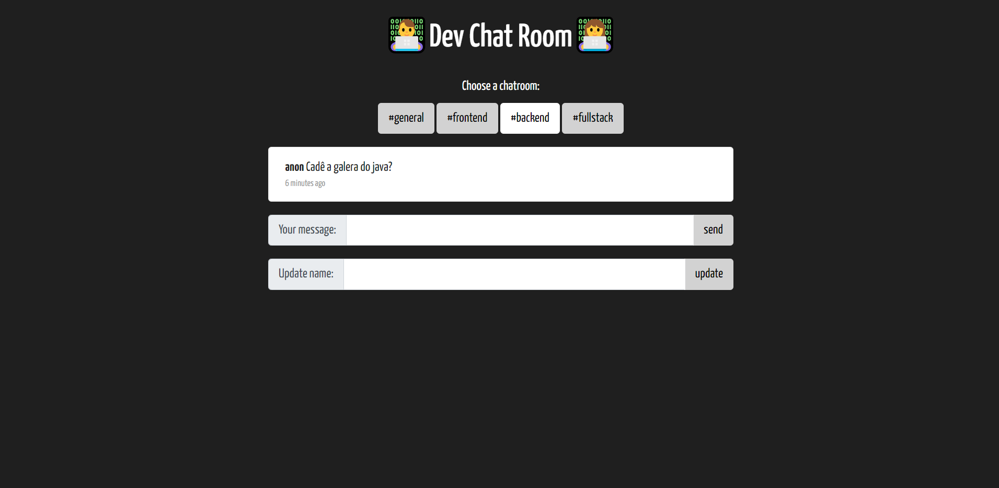
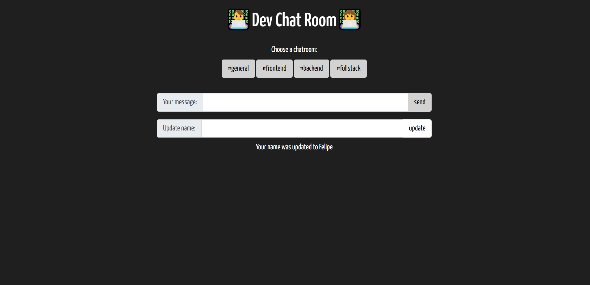

# Realtime Chat App usando Js e Firebase

   

Chat em tempo real usando JavaScript e Firebase.

## Ferramentas e Tecnologias

- HTML5 - Linguagem de Marcação;
- CSS3 - Folhas de Estilo;
- JavaScript - Linguagem de Programação;
- Firebase - Back-end as a Service (BaaS).

## Imagens

  
  

  
  

